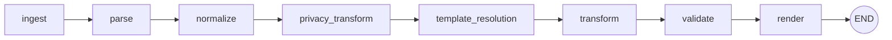
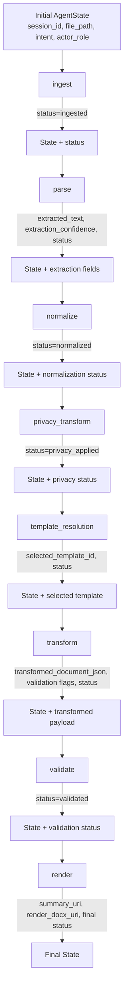
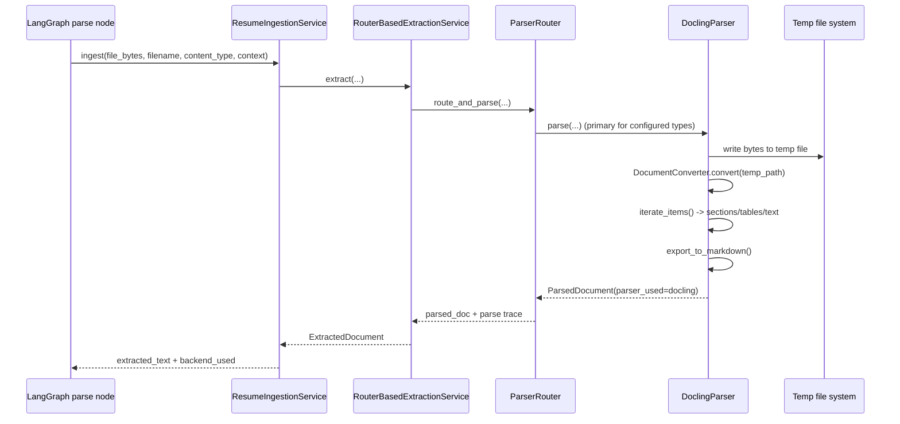
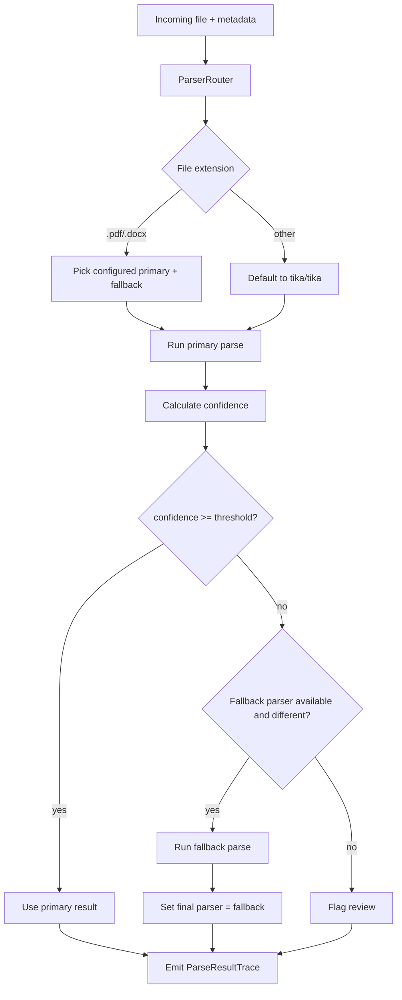

# Architecture Code Analysis (LangGraph, State, Patterns, Docling/Tika)

This document provides a code-level analysis of how architecture is implemented in the current repository, with special focus on:

- LangGraph workflow design and state handling
- Architectural patterns in use (ports/adapters, orchestration, fallback, policy boundaries)
- How Docling and Apache Tika are integrated and routed
- Gaps and refactor opportunities

---

## 1) Current Architecture at a Glance

The backend follows a layered approach with a clear **domain interface boundary** and pluggable adapters:

- **Domain interfaces / protocols** define contracts (`DocumentExtractionService`, `DocumentParser`, `StorageProvider`, etc.).
- **Service layer** orchestrates domain-level behavior (`ResumeIngestionService`, `ParserRouter`, template resolution/validation services).
- **Adapter layer** encapsulates implementation details (Docling, Tika, Azure Document Intelligence, cloud storage providers).
- **LangGraph workflow** composes request execution as a bounded, stage-based graph from ingest → parse → normalize → privacy → template resolution → transform → validate → render.

The design intent is strong: keep cloud/parser/provider specifics out of business workflow code.

---

## 2) LangGraph Workflow Analysis

### 2.1 Graph topology and execution order

In `backend/app/agent/graph.py`, `build_workflow_graph(...)` defines a linear graph:

1. `ingest`
2. `parse`
3. `normalize`
4. `privacy_transform`
5. `template_resolution`
6. `transform`
7. `validate`
8. `render`
9. `END`

Observations:

- The graph is currently **bounded and deterministic** (no dynamic branching/conditional edges yet).
- `template_resolution` and `transform` are the explicit "agentic" nodes using LLM runtime injection.
- Parse node depends on `DocumentExtractionService` and storage provider, reinforcing dependency inversion.

### 2.2 State contract quality

`backend/app/agent/state.py` uses a `TypedDict` (`AgentState`) as the graph state schema.

Strengths:

- Fields cover extraction output, normalized model, privacy model, template selection, validation, outputs, and orchestration flags.
- Intent metadata (`intent`, `actor_role`, `filename`, `content_type`) supports multi-lane behavior.

Risks / improvement points:

- `TypedDict` gives static shape but **no runtime validation** by default during graph transitions.
- Some fields are loosely typed (e.g., `formatting_rules: Optional[str]`, JSON payloads as strings).
- Node outputs are partially status-only (`{"status": "normalized"}`), so canonical payload propagation is still shallow in this implementation.

### 2.2.1 Workflow + state transition map

The graph advances by merging each node output dictionary into shared `AgentState`.

### 2.3 Node implementation pattern

Node factories (`create_transform_node`, `create_template_resolve_node`, `create_render_node`) follow a closure-based dependency injection pattern:

- Inject runtime adapters once.
- Return node function that reads/writes `AgentState` fragments.

This is a good pattern for testability and replacement of implementations.

However:

- There is mixed sync/async handling in template resolution (`asyncio.run(...)` inside a sync node), which can cause event-loop issues in some runtimes.
- Graph-level retry, conditional routing, and checkpointer integration are not yet wired.

---

## 3) Architectural Patterns in Use

### 3.1 Ports & Adapters (Hexagonal) — actively used

The code consistently uses domain contracts with provider-specific adapters behind them.

Examples:

- `DocumentExtractionService` protocol (`backend/app/domain/interfaces/document_extraction.py`).
- `RouterBasedExtractionService` adapter bridging parser routing into the extraction service contract (`backend/app/services/extraction_service_adapter.py`).
- Storage and LLM provider selection through dependency factories (`backend/app/dependencies.py`).

### 3.2 Strategy + Fallback routing — parser path

`ParserRouter` is effectively a strategy selector with confidence-based fallback:

- Primary/fallback parser selected by extension and config.
- Primary parse attempt scored via `ParseConfidenceService`.
- Fallback executed when primary fails or confidence is below threshold.
- Rich trace emitted (`ParseResultTrace`, per-attempt telemetry).

This is a solid operational pattern for OCR/parser variability.

### 3.3 Pipeline orchestration

LangGraph wraps the end-to-end flow as stages, while services/adapters implement stage internals.

- Good separation: workflow orchestrates; adapters/services do work.
- Remaining gap: several stages are currently placeholders (normalize/privacy/validate) returning status only.

---

## 4) Docling Integration — Detailed Analysis

`backend/app/adapters/parsers/docling_parser.py`

### What it does now

- Lazily initializes `DocumentConverter`.
- Writes incoming bytes to a temporary file (cross-platform safety).
- Runs `converter.convert(tmp_path)`.
- Iterates document items to collect:
  - text/paragraph chunks
  - section headers mapped to `ParsedSection`
  - simple table extraction mapped to `ParsedTable`
- Exports full text as markdown via `doc.export_to_markdown()`.
- Returns `ParsedDocument` with `parser_used="docling"` and raw payload metadata.

### Strengths

- Produces richer structure than plain text parsers (sections/tables/markdown).
- Cleans up temp file in `finally` block.
- Declares capabilities (`tables`, `sections`, `markdown`, `ocr`).

### Constraints / caveats

- Converter initialization is in-process; heavy workloads may need worker pools.
- Parsing is CPU-bound and currently not offloaded to executor.
- Structured extraction is minimal (section content assembly and rich table semantics are basic).

---

## 5) Apache Tika Integration — Detailed Analysis

`backend/app/adapters/parsers/tika_parser.py`

### What it does now

- Uses `tika.parser.from_buffer(file_bytes)` for extraction.
- Returns normalized `ParsedDocument` with:
  - plain `text`
  - `metadata`
  - `parser_used="tika"`
  - warning that structure may be lost.

### Strengths

- Broad format support (`supports(...) -> True`).
- Effective generic fallback when structured parser fails or unsupported file arrives.
- Simple health check included.

### Constraints / caveats

- No native section/table structure in current mapping.
- Depends on Tika runtime/JVM ecosystem behavior; operational setup can vary by environment.
- Confidence is naturally lower in router logic because structure is limited.

---

## 6) How Docling and Tika Are Used Together (Actual Routing Behavior)

The effective behavior is defined by `ParserRouter` + config thresholds.

1. Determine extension (`.pdf`, `.docx`, etc.).
2. Choose configured primary and fallback parser names.
3. Run primary parse and compute confidence.
4. If confidence is below `parser_min_confidence` (or parse fails), run fallback parser.
5. Emit parse trace with attempts, timings, confidence, warnings, review flags.

Practical consequence:

- **Docling-first, Tika-fallback** is the likely robust default for resumes when structure matters.
- If Docling returns sparse text/structure, router can downgrade and fallback to Tika for extraction resilience.
- Downstream services can consume both normalized `ParsedDocument` and `trace` for governance/QA.

---

## 7) State + Pattern Fit with Platform Goals

The architecture aligns with intended goals (bounded autonomy, governance, cloud agnostic), but implementation maturity is mixed:

- **Strong:** contract boundaries, adapter injection, parser routing with telemetry.
- **Partial:** state richness exists but many nodes are still placeholder outputs.
- **Needs hardening:** async model consistency, checkpointer adoption, and stronger runtime state validation.

---

## 8) Recommended Next Refactors (Priority Ordered)

1. **Unify async model in LangGraph nodes**
   - Convert synchronous nodes that call async code into native async nodes.
   - Remove nested `asyncio.run(...)` usage from node internals.

2. **Promote state schema from loose TypedDict to validated models at boundaries**
   - Keep `TypedDict` for graph compatibility if needed, but validate node I/O with Pydantic models.

3. **Complete currently stubbed stages**
   - `normalize`, `privacy_transform`, `validate` should write domain payloads (not only statuses).

4. **Persist and expose parse trace end-to-end**
   - Include parser attempts/confidence in job record and admin review UI.

5. **Deepen Docling structured mapping**
   - Build hierarchical sections and better table normalization.

6. **Add parser policy matrix by intent**
   - Candidate runtime vs admin asset ingest can have different parser preferences and confidence gates.

7. **Wire checkpointer for recoverability/audit**
   - Integrate graph checkpointing in compile/run path.

---

## 9) Documentation Consolidation Note

Architecture-focused documents have been moved to the root `Docs/` folder for a single documentation entry point:

- `Docs/ARCHITECTURE.md`
- `Docs/CLOUD_SERVICES.md`
- `Docs/ARCHITECTURE_CODE_ANALYSIS.md` (this file)
