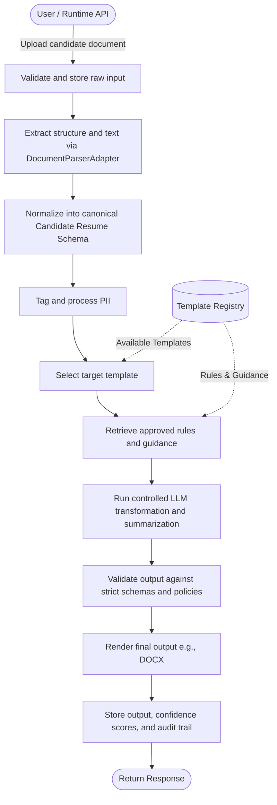

# Agentic Document Processing Platform Architecture

This platform processes two distinct classes of documents: governed template/knowledge assets and runtime candidate documents. It uses deterministic extraction, controlled reasoning, governed templates, and policy-driven privacy handling to produce structured outputs and final rendered documents. This is a **template-aware, privacy-governed, cloud-agnostic document processing platform**. It supports admin-governed template/knowledge ingestion alongside runtime candidate document processing. This is **not** an unconstrained autonomous agent system; it is a **bounded workflow-oriented architecture** that uses AI safely within deterministic orchestration pipelines (powered by LangGraph).

---

## 2. Goals and Non-Goals

### Goals
* Support a dual document-processing model (admin vs. runtime).
* Support a cloud-agnostic core design utilizing an adapter pattern.
* Support multiple parser/extractor backends dynamically.
* Support a governed template lifecycle.
* Support PII-aware runtime processing with strict policies.
* Support final document rendering from approved templates.
* Support bounded agentic orchestration for targeted ambiguity resolution.
* Expose capabilities via A2A (Agent-to-Agent) and MCP (Model Context Protocol).

### Non-Goals
* Unconstrained or free-roaming autonomous behavior.
* Persistent personal conversational memory for candidates.
* Full ATS (Applicant Tracking System) replacement.
* Opaque black-box prompting without schema validation.
* Cloud provider lock-in at the core architecture level.

---

## 3. Dual Processing Model

The platform separates document processing into two distinct architectural lanes to prevent mixed responsibilities and ensure high-quality outputs.

### 3.1 Template and Knowledge Processing Plane (Admin)
* **Trigger:** Admin APIs and Admin UI.
* **Processes:** Templates (e.g., DOCX), KB documents, policy documents, formatting guides, and example outputs.
* **Produces:** Template metadata, structured rules, vector-indexed chunks, render configurations, and formally approved runtime assets.

### 3.2 Candidate Runtime Processing Plane (Runtime)
* **Trigger:** User UI, Runtime APIs, external A2A/MCP calls.
* **Processes:** Candidate resumes/CVs and optional supporting documents.
* **Produces:** Normalized candidate schemas, redacted PII views, generated summaries, final formatted outputs, and validation reports.

### 3.3 Relationship Between the Two Planes
The Template/Knowledge plane acts as the governor. It publishes approved assets into a read-only registry. The Candidate Runtime plane consumes these approved assets to drive its logic. The runtime **does not** directly use unapproved or draft raw admin documents.

---

## 4. Architecture Principles

* **Deterministic first, LLM second:** Core orchestration and validation are deterministic; LLMs are used only for specific transformations.
* **Cloud is an integration concern, not a business-logic concern:** Core workflows depend only on interfaces, relying on dependency injection for AWS/Azure/GCP implementations.
* **Parser choice is orthogonal to cloud choice:** You can run AWS Textract on Azure, or Azure Document Intelligence on GCP, or local Apache Tika everywhere.
* **Templates are governed assets, not raw files:** They have lifecycles, versions, and metadata.
* **Privacy is architectural, not cosmetic:** PII rules dictate data flow boundaries, not just prompt instructions.
* **Memory must be bounded and auditable:** System state is scoped to the current run or explicitly defined reference sets.
* **Outputs must be validated before publishing:** Strict schema and policy gates apply before rendering.
* **Retrieval must use approved knowledge only:** RAG pipelines fetch only from the published template registry.

---

## 5. High-Level Logical Architecture

### 5.1 Admin / Governance Plane
* **Admin UI / Admin API:** Interfaces for uploading and managing templates.
* **Template Asset Store:** Blob storage for raw and processed template assets.
* **Knowledge Extractor:** Pipeline to parse rules and KB guides.
* **Metadata Catalog:** Database tracking template versions, statuses, and tags.
* **Approval/Publishing Workflow:** State machine for draft -> validated -> approved -> published.
* **Search/Vector Indexing:** Engine for semantic retrieval of rules and chunked guidance.
* **Template Registry:** The final, read-only store of active templates for runtime use.

### 5.2 Runtime / Candidate Plane
* **User UI / Runtime API:** Interfaces for candidate uploads and tracking.
* **Candidate Upload & Ingest:** Intake boundary with malware scanning and ID assignment.
* **Document Extractor:** Configurable OCR and layout parser (e.g., Azure Doc Intel, Textract, Docling).
* **Canonical Mapper:** Translates raw parser JSON into standard schema.
* **PII Policy Engine:** Detects and redacts sensitive fields based on policy matrices.
* **Template Selector:** Deterministic filters + semantic scoring to pick the right template.
* **Retrieval Orchestrator:** Fetches grounded context (rules, styles) from the Template Registry.
* **Summary/Transformation Engine:** Bounded LLM node for drafting summaries and rewriting content.
* **Validation Engine:** Enforces schema adherence, chronology consistency, and PII safety.
* **Renderer:** Injects canonical data into the target template package (DOCX/PDF generation).
* **Output Store:** Persists final artifacts and run traces.

### 5.3 Shared Services
* Identity and RBAC
* Secrets Management
* Object Storage
* Metadata DB
* Workflow Orchestration (LangGraph)
* Monitoring and Audit Trace
* Search/Vector Index
* Notification/Event Bus

---

## 6. Document Processing Model

### 6.1 Template Asset Processing Flow (Admin Pipeline)
Template creation is governed by a strict, state-saving linear pipeline to ensure validity before impacting runtime operations:

1. **Ingest & Metadata:**
   * Upload asset via admin API (DOCX/PDF).
   * Enrich preliminary metadata (industry, role, region, language).
   * Record is created in `Draft` state.
2. **Extraction & Classification:**
   * Extract structure and text via DocumentParserAdapter.
   * Admin reviews extraction output and corrects any auto-classification fallbacks.
3. **Intelligence & Rules Configuration:**
   * Derive or explicitly attach target section rules (e.g., `TemplateRule` for max bullets, tone).
   * Chunk and index KB/guidance content associated with the template into the semantic vector index.
4. **Validation & Pre-flight Simulation:**
   * Run simulation using test candidate resumes against the configured rules.
   * System generates a validation report enforcing mandatory sections, PII leakage prevention, and render conformance.
5. **Governance & Publishing:**
   * Submit for human review (changes state to `Pending Review`).
   * Authorized User (Reviewer) examines audit trail and triggers transition to `Approved`.
   * Publish approved assets to the read-only runtime Template Registry (`Published` state).

### 6.2 Candidate Document Processing Flow
1. Upload candidate document.
2. Validate and store raw input.
3. Extract structure and text via configured DocumentParserAdapter.
4. Normalize into canonical Candidate Resume Schema.
5. Tag and process PII (generate redacted views).
6. Select target template from registry.
7. Retrieve approved rules and guidance for the chosen template.
8. Run controlled LLM transformation and summarization.
9. Validate output against strict schemas and policies.
10. Render final output (e.g., DOCX).
11. Store output, confidence scores, and audit trail.



### 6.3 Shared Processing Stages
* Schema validation
* Provenance tracking
* Confidence scoring
* Audit logging
* Version resolution

---

## 7. Canonical Data Contracts

The platform relies on strict, cloud-agnostic JSON schemas to pass data between pipeline stages. Parser-specific details belong in metadata/extensions, not in the core schemas.

### 7.1 Template Asset Schema
Represents a governed template in the catalog.
```json
{
  "template_id": "tpl-uk-it-001",
  "name": "UK IT Consultant Template",
  "asset_type": "template",
  "industry": "IT Services",
  "role_family": "Application Development",
  "region": "UK",
  "language": "en",
  "version": "1.0.0",
  "status": "approved",
  "storage_refs": {
    "source_asset": "blob://templates/tpl-uk-it-001/template.docx",
    "render_package": "blob://templates/tpl-uk-it-001/render-package.json"
  },
  "rule_refs": [
    "rule-summary-uk-it",
    "rule-pii-standard"
  ],
  "render_config_ref": "blob://templates/tpl-uk-it-001/render-config.json",
  "metadata": {
    "created_by": "admin-user",
    "approved_by": "reviewer-user"
  }
}
```

### 7.2 Template Rule Schema
Defines specific rendering or extraction behaviors for a template.
```json
{
  "rule_id": "rule-summary-uk-it",
  "template_id": "tpl-uk-it-001",
  "rule_type": "section_format",
  "target_section": "summary",
  "condition": {
    "industry": "IT Services",
    "language": "en"
  },
  "action": {
    "max_bullets": 5,
    "tone": "professional",
    "highlight_domains": true
  },
  "priority": 100,
  "version": "1.0.0",
  "status": "approved"
}
```

### 7.3 Candidate Resume Canonical Schema
The normalized representation of extracted candidate data.
```json
{
  "document_id": "doc-123",
  "candidate": {
    "full_name": "Jane Doe",
    "emails": ["jane@example.com"],
    "phones": ["+44-000000000"],
    "addresses": ["London, UK"],
    "social_links": ["https://linkedin.com/in/janedoe"]
  },
  "profile": {
    "headline": "Senior Java Engineer",
    "summary": "Experienced backend engineer...",
    "total_experience_years": 9
  },
  "skills": {
    "primary": ["Java", "Spring Boot", "AWS"],
    "secondary": ["Kafka", "Docker"],
    "domains": ["Retail", "Loyalty"]
  },
  "employment_history": [
    {
      "company": "Example Corp",
      "title": "Senior Engineer",
      "start_date": "2021-01",
      "end_date": "2024-12",
      "is_current": false,
      "responsibilities": ["Built APIs", "Led migration"],
      "technologies": ["Java", "AWS", "Kafka"]
    }
  ],
  "education": [],
  "certifications": [],
  "projects": [],
  "metadata": {
    "source_type": "pdf",
    "parser_used": "azure_document_intelligence",
    "ocr_confidence": 0.94,
    "extraction_confidence": 0.89
  },
  "source_provenance": {
    "uploaded_by": "user-1",
    "upload_timestamp": "2026-04-01T10:00:00Z"
  }
}
```

### 7.4 Processing Job Schema
Tracks the execution state of a document processing run.
```json
{
  "job_id": "job-123",
  "job_type": "candidate_processing",
  "input_document_refs": [
    "blob://raw/job-123/resume.pdf"
  ],
  "selected_template_id": "tpl-uk-it-001",
  "status": "running",
  "stage_status": {
    "ingest": "completed",
    "extract": "completed",
    "normalize": "completed",
    "pii": "completed",
    "template_select": "completed",
    "transform": "running",
    "validate": "pending",
    "render": "pending"
  },
  "timestamps": {
    "created_at": "2026-04-01T10:00:00Z",
    "updated_at": "2026-04-01T10:01:30Z"
  },
  "warnings": [
    "Low confidence in education date range"
  ],
  "error_summary": null
}
```

### 7.5 Validation Result Schema
Records the output of the validation engine prior to final rendering.
```json
{
  "validation_id": "val-123",
  "job_id": "job-123",
  "checks": [
    {
      "name": "mandatory_sections_present",
      "status": "passed",
      "severity": "high"
    },
    {
      "name": "pii_leakage_check",
      "status": "passed",
      "severity": "critical"
    },
    {
      "name": "chronology_consistency",
      "status": "warning",
      "severity": "medium",
      "details": "Employment gap could not be fully resolved"
    }
  ],
  "severity": "warning",
  "confidence_score": 0.87,
  "template_conformance": 0.92,
  "pii_findings": [],
  "publishable": true
}
```

---

## 8. Template Intelligence and Knowledge Layer

### 8.1 Template Repository
Templates are versioned governed assets. The underlying source of truth may be a combination of Git (for code/schemas), Object Storage (for binary assets), and a Metadata DB. Only approved/published versions are available to the runtime.

### 8.2 Metadata Catalog
Maintains search facets for templates, including:
* Industry
* Role family
* Region
* Language
* Status (draft, validated, approved, published, retired)
* Version
* Rule and render configuration references

### 8.3 Knowledge Indexing
Knowledge Base (KB) documents and guidance are chunked and embedded into a vector search index. Chunks carry provenance and version metadata. At runtime, the retrieval stage only fetches from approved knowledge.

### 8.4 Template Selection Model
When a candidate document arrives, template selection follows a bounded path:
1. **Deterministic Filters:** Drop templates that don't match language/region.
2. **Scoring:** Rank remaining templates by role/industry match.
3. **Optional LLM Tie-Break:** Use reasoning if multiple strong candidates exist.
4. **Manual Override:** Allow users or API callers to force a specific template.

### 8.5 Publishing Lifecycle
Templates progress through distinct states:
`Draft` -> `Validated` -> `Approved` -> `Published` -> `Retired`

---

## 9. Extraction and Normalization Model

### 9.1 Parser/Extractor Abstraction
The parser provider is pluggable and abstracted behind the `DocumentParserAdapter`. The cloud deployment target and the parser backend are independent dimensions.
Examples: Azure Document Intelligence, AWS Textract, GCP Document AI, Docling, Apache Tika, Unstructured.

### 9.2 Extraction Stages
1. File validation
2. Type detection
3. OCR/layout extraction
4. Section segmentation
5. Field normalization
6. Confidence scoring
7. Artifact generation

### 9.3 Normalization Responsibilities
The canonical mapper is strictly responsible for inference of canonical sections, normalizing dates/skills, and preserving provenance. It is instructed explicitly **not to invent facts**.

---

## 10. PII and Privacy Model

### 10.1 PII Categories
* Direct identifiers (Names, phone numbers, emails, addresses)
* Quasi-identifiers (Demographic details)
* Professional non-sensitive data

### 10.2 Policy Actions
Policies evaluate fields and apply actions:
* Retain
* Mask
* Redact
* Tokenize
* Role-restrict

### 10.3 Data Zones
Data flows through zones with increasing policy strictness:
* **Raw Zone:** Original uploaded document.
* **Extraction Zone:** Raw parser JSON output.
* **PII-Controlled Zone:** Fields are tagged.
* **Model-Input Zone:** Redacted view safe for LLM consumption.
* **Presentation Zone:** Formatted for recruiters/reviewers.
* **Audit Zone:** Secured logs.

### 10.4 PII Operating Rules
* Send the minimum necessary data to the LLM (Model-Input Zone).
* Raw PII is never logged by default.
* Recruiter-safe views and internal views may differ.
* Field-level decisions must be auditable.

---

## 11. Memory Model

The platform does **not** employ open-ended autonomous agent memory or persistent conversational profile memory of candidate data. Memory is strictly categorized.

### 11.1 Reference Memory
Produced by the admin flow, consumed by the runtime flow.
* Template rules
* KB guidance
* Section policies
* Formatting standards
* Validation rules

### 11.2 Session Memory
Used only during active job execution within the LangGraph workflow.
* Extracted artifacts
* Selected template
* Runtime warnings
* Intermediate pipeline outputs

### 11.3 Episodic Run Memory
* Job history
* Validation history
* User feedback on the final output
* Correction traces

### 11.4 Analytics Memory
* Aggregated quality metrics
* Template usage stats
* Error trends (not raw candidate data)

### 11.5 Explicit Non-Goal
No persistent personal conversational memory. No unconstrained agentic contexts spanning multiple candidates.

---

## 12. Validation and Guardrails

The platform utilizes a strict validation engine before any output is finalized.

* **Schema Validation:** Ensures the intermediate outputs match the canonical schemas.
* **Chronology Checks:** Flags overlapping dates or gaps in employment.
* **Section Completeness:** Ensures mandatory sections defined by the template rule are populated.
* **Template Conformance:** Validates the structure matches the template render package.
* **PII Leakage Checks:** Final scan to ensure redacted tokens didn't leak into public fields.
* **Hallucination Prevention:** Grounding outputs against the extracted source artifacts.

**Job Output States:**
* `success`
* `success_with_warnings`
* `review_required`
* `failed`

---

## 13. API Surface

The system supports several interaction patterns via REST, A2A, and MCP.

### 13.1 Admin APIs
* Upload asset (`POST /admin/assets/upload`)
* Update metadata
* Validate asset
* Submit for review
* Approve/publish
* List/search versions
* Retire/rollback

### 13.2 Runtime APIs
* Upload candidate document (`POST /runtime/jobs`)
* Start processing
* Get job status
* Fetch summary
* Fetch formatted output
* Submit feedback

### 13.3 Internal Service APIs
* Template registry lookup
* Retrieval bundle fetch
* Validation service
* Rendering service

---

## 14. Storage and Deployment Model

### 14.1 Storage Model
* **Object Storage:** For raw inputs, template binaries, and rendered artifacts.
* **Metadata Store:** For job state, audit trails, and template catalog.
* **Search/Vector Index:** For chunked KB and rule retrieval.

### 14.2 Cloud-Agnostic Deployment Model
Core business logic remains cloud-agnostic. Provider adapters supply storage, OCR/parser, model, queue, and monitoring integrations. While Azure may serve as the first reference implementation, it does not dictate the architecture.

### 14.3 Suggested Runtime Mapping (Pluggable)
| Component | Azure Reference | AWS Reference | GCP Reference | Local Emulator |
| :--- | :--- | :--- | :--- | :--- |
| Object Store | Azure Blob Storage | S3 | GCS | Local File/Azurite |
| Metadata DB | Cosmos DB | DynamoDB | Firestore | SQLite |
| Search/Vector | AI Search | OpenSearch | Vertex Search | Chroma/FAISS |
| Model Provider | Azure OpenAI | Bedrock | Vertex AI | Ollama |
| Parser Provider | Document Intelligence | Textract | Document AI | Docling/Tika |

---

## 15. Implementation Epics

* **Epic 1:** Architecture and Data Contracts
* **Epic 2:** Template Admin Ingest and Governance
* **Epic 3:** Runtime Candidate Processing
* **Epic 4:** Rendering and Output Validation
* **Epic 5:** PII Governance and Auditability
* **Epic 6:** Observability and Analytics

---

## 16. Implementation Roadmap

* **Phase 1:** Contracts and architecture baseline (Schemas, foundational interfaces).
* **Phase 2:** Admin/template ingest plane (Asset upload, metadata, publishing workflow).
* **Phase 3:** Candidate processing plane (Extraction, normalization, selection, transformation).
* **Phase 4:** Validation, analytics, feedback, hardening (Guardrails, dashboards).

---

## 17. Risks and Open Design Questions

* **Template Fidelity vs. Flexible Rendering:** Balancing pixel-perfect rendering against dynamic LLM text generation.
* **Template Sprawl:** Managing multiple template families by region/industry/JD without overwhelming the selector.
* **Quality of Inputs:** Handling exceptionally low-quality scanned resumes effectively across different parsers.
* **PII Policy Granularity:** Deciding exact PII redaction rules per market/client compliance standard.
* **Supporting Documents:** Determining if/when supporting documents (cover letters, portfolios) enter the Day-1 runtime flow.
* **Batch Processing:** Determining if API bulk mode is a Day-1 requirement.
* **User Override:** Establishing how much manual override is allowed in the template selection process by end-users.
