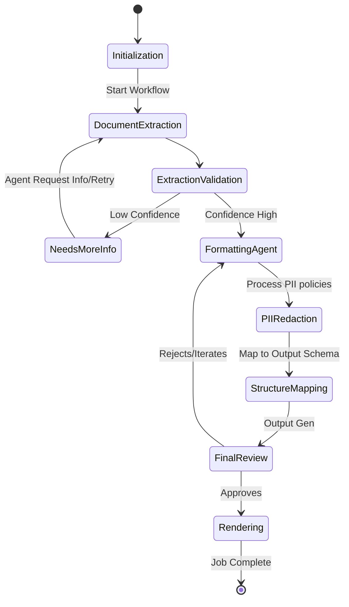
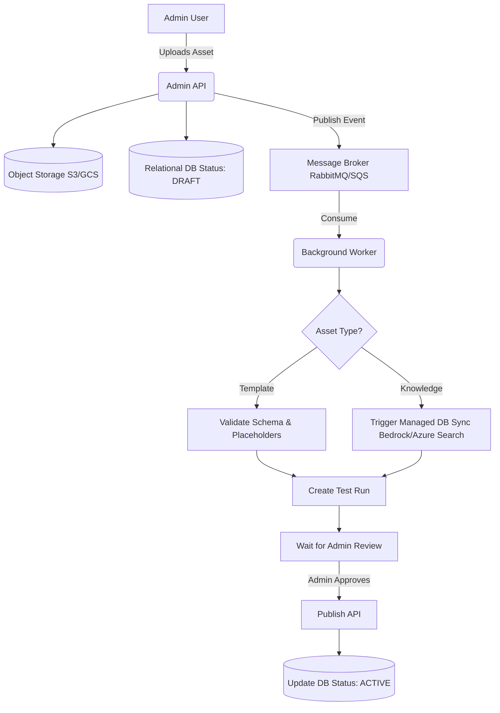
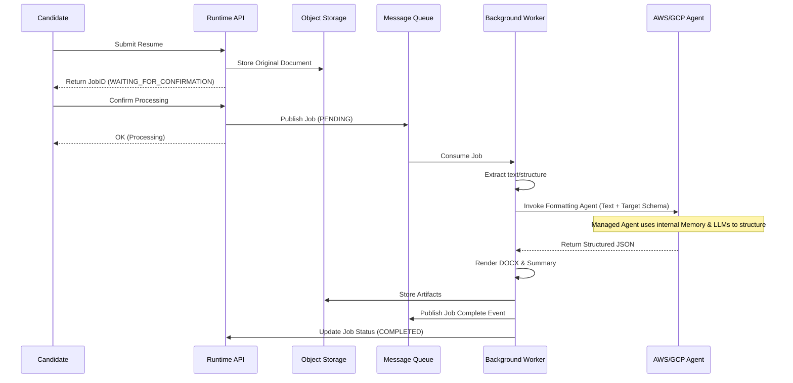

# Architecture Analysis: Cloud-Managed Vector DBs and Agentic Memory

## 1. Current State of Vector Database Usage

### 1.1 How We Currently Use Vector DBs
In our backend, we use vector databases to power our **Knowledge Base** capabilities, which are primarily utilized for Template/Asset recommendation (e.g., via the `HybridTemplateRanker`) and context injection for LLM prompts.

- **Interface Abstraction**: The core interaction is defined by the `KnowledgeIndex` interface in `backend/app/domain/interfaces/__init__.py`. This interface exposes two main methods:
  - `index_chunks(chunks, asset_id)`: To store parsed text chunks.
  - `search(query, filters, top_k)`: To retrieve semantically similar chunks.
- **Implementations**:
  - `QdrantKnowledgeIndex`: The default, locally running (or memory-bound) vector database. It uses the `EmbeddingProvider` to calculate vector embeddings natively before upserting into the index.
  - `ChromaKnowledgeIndex`: Acts as the first fallback.
  - `InMemoryKnowledgeIndex`: Acts as the secondary fallback for simple testing.
- **Dependency Injection**: The `get_knowledge_index()` factory in `backend/app/dependencies.py` tries to load Qdrant, falls back to Chroma, and finally falls back to InMemory.

### 1.2 Limitations of the Current Approach
- **Embedding Bottleneck**: The backend is tightly coupled to an `EmbeddingProvider` that calculates vectors in the Python runtime before sending them to Qdrant. This does not map well to managed cloud services that often handle both chunking and embedding internally.
- **Lack of Native Memory**: Managed "Agentic Memory" (e.g., tracking user/agent conversational history semantically) isn't explicitly supported in our `KnowledgeIndex` interface, which is currently tuned strictly for document/asset knowledge retrieval.

---

## 2. Transitioning to Cloud Managed Services (AWS, Azure, GCP)

### 2.1 Target Managed Services
- **AWS**: Amazon Bedrock Knowledge Bases / Amazon Bedrock Agents (offers managed RAG, automatic embedding, and session-based agentic memory).
- **Azure**: Azure AI Search (formerly Cognitive Search) and Azure OpenAI Assistants.
- **GCP**: Vertex AI Agent Builder / Vertex AI Search and Conversation.

### 2.2 Required Architectural Changes
To adopt these services, we need to alter how the backend interacts with "knowledge":

1. **Evolve the `KnowledgeIndex` Interface**:
   - Currently, `index_chunks` expects pre-chunked text dicts. Managed services like Bedrock Knowledge Bases or Vertex AI usually prefer ingesting raw documents (e.g., pointing them to an S3 bucket or Google Cloud Storage bucket) and they handle the chunking, embedding, and vector storage autonomously.
   - **Recommendation**: Create a higher-level interface like `ManagedKnowledgeBase` with methods like `sync_asset(asset_uri)` instead of manually passing text chunks. The application should store the extracted doc in cloud storage and trigger a sync job on the managed service.
2. **Abstract the Search Interface**:
   - When searching, instead of generating embeddings locally, the new adapters (e.g., `AwsBedrockKnowledgeIndex`) will invoke the cloud API (e.g., `RetrieveAndGenerate` in AWS Bedrock).
   - This means `search(query)` will delegate entirely to the cloud SDK, bypassing the local `EmbeddingProvider`.
3. **Agentic Memory Interface**:
   - To utilize managed memory (like Bedrock Agents memory), we should introduce a new interface `AgentMemoryProvider` to store and retrieve execution context, separating conversational/workflow memory from the `KnowledgeIndex` (which is for static template data).
4. **Cloud-Native Dependency Injection**:
   - `get_knowledge_index()` should read from standard config (`settings.cloud_provider`) to instantiate cloud-specific adapters (e.g., returning `AwsBedrockKnowledgeIndex` if provider is AWS) rather than hard-coding local fallbacks.

---

## 3. Visualizing Agent & System Workflows

### 3.1 Agent Workflow (State Machine / DAG)
The managed Agentic memory and LLM logic can be visualized as a DAG (Directed Acyclic Graph) or State Machine orchestrating tasks.

### 3.2 Template Ingestion to Publish Workflow
To improve the Template Ingestion flow, moving to an asynchronous event-driven model guarantees scalability.

### 3.3 Resume Processor (Formatter) Sequence Diagram
Here is the decoupled sequence of the Resume Formatter, utilizing a queue and a Cloud-managed formatting Agent.

---

## 4. Improving Flow & Architecture

### 4.1 Template Ingestion Flow Improvements
Currently, Template Ingestion routes documents through extraction, manual chunking, and local vector indexing.
- **Improvement - Event-Driven Ingestion**:
  1. Admin uploads template/knowledge asset.
  2. API stores the raw document in Object Storage (S3/GCS/Blob) and saves metadata to the Relational DB (Postgres).
  3. API publishes an `AssetUploadedEvent` to a Message Broker (RabbitMQ/SQS/PubSub).
  4. A background worker picks up the event. If using a managed service, it triggers the managed Data Source Sync (e.g., telling Bedrock to sync the S3 bucket). This decouples the API from heavy chunking and processing.

### 4.2 Resume Processor (Formatter) Flow Improvements
The Resume Processor needs to be fast and handle varied document formats.
- **Improvement - Decoupled Pipeline**:
  - Rather than synchronous extraction, parsing, and LLM processing, break it down:
    1. **Upload & Confirm**: User submits resume -> stored in Object Storage -> Job created in DB -> `WAITING_FOR_CONFIRMATION`.
    2. **Processing Workflow (LangGraph/Workers)**: Upon confirmation, a background worker coordinates the steps.
  - **Using Agentic Core**: For formatting, we can delegate the complex mapping of unstructured resume text to structured JSON to a managed Agent (e.g., an AWS Bedrock Agent). We pass the document text to the Agent, and the Agent executes a predefined workflow returning strictly typed JSON, alleviating our internal `llm_runtime` of complex prompt orchestration.

---

## 4. Scalability: Managed Hosting & Kubernetes (K8s)

To ensure this architecture scales elegantly both in fully-managed serverless environments (like AWS Fargate / GCP Cloud Run) and in Kubernetes (EKS, GKE):

1. **Stateless APIs**:
   - Ensure the FastAPI web servers hold zero state. All temporary files must be written to cloud storage or ephemeral `/tmp` volumes, and all state (sessions, job status) must be in the Database or Redis.
2. **Message-Driven Background Workers**:
   - The current `core/worker.py` should be deployed as an independent container scaling based on Queue depth (e.g., using KEDA in Kubernetes to scale workers based on SQS/RabbitMQ queue length).
3. **Externalizing Local Components**:
   - Replace the local SQLite default with managed PostgreSQL (Amazon RDS, Cloud SQL).
   - Replace LocalQueue with fully managed queues (SQS, Service Bus, Pub/Sub).
   - Replace Qdrant/Chroma with either managed cloud vector databases (Pinecone, Azure AI Search) or fully managed RAG solutions (Bedrock KB).
4. **Agent Concurrency**:
   - If using cloud-hosted Agents, scaling the worker simply means making more parallel HTTP calls to AWS/Azure/GCP. Ensure background workers use asynchronous IO (`asyncio` / `aiohttp` or async boto3 clients) to maximize throughput without blocking OS threads.
