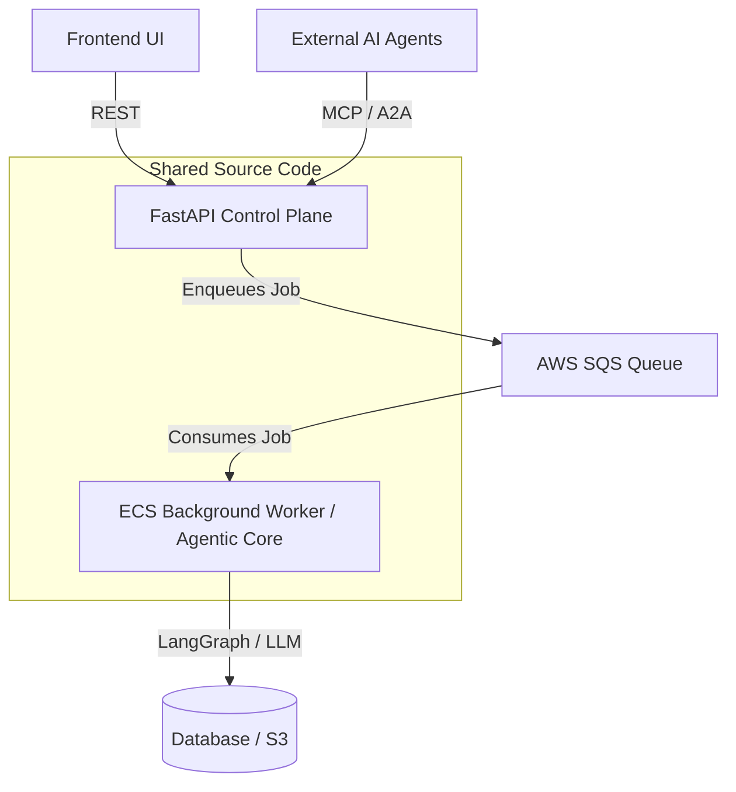
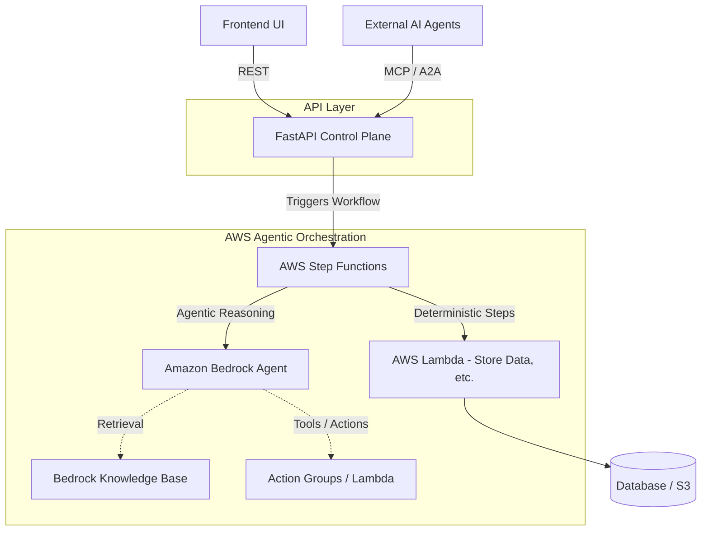

# Architecture Proposal: Evolving the Background Worker to AWS Agentic AI Tools

## 1. Current State Architecture

Currently, the backend system leverages a shared source code repository to run two distinct planes of operation:

1.  **API Control Plane (FastAPI):**
    *   Serves the frontend UI.
    *   Exposes Model Context Protocol (MCP) endpoints.
    *   Provides Agent-to-Agent (A2A) protocol support for external agent consumers or the internal agentic core.
2.  **Worker Execution Plane (ECS/Agentic Core):**
    *   Runs background processing jobs.
    *   Executes LangGraph workflows (e.g., document extraction, template parsing).
    *   Utilizes an internal "Agentic Core" for specific, bounded reasoning tasks (template contract generation, rule retrieval, mapping, output quality reasoning).

While sharing the source code simplifies development, managing the background worker as a set of ECS tasks requires maintaining long-running compute infrastructure, scaling policies, and custom orchestration logic (LangGraph state management, queue polling, etc.).

### Current Architecture Diagram

## 2. Proposed Future State: AWS Managed Agentic AI Tools

To reduce operational overhead, improve scalability, and leverage purpose-built AI orchestration, we propose evaluating and transitioning the custom ECS "Agentic Core" worker to AWS managed agentic AI tools.

### Key AWS Candidates and Suggestions

#### A. Amazon Bedrock Agents (Primary Recommendation)

**Overview:** Amazon Bedrock Agents enable developers to create autonomous agents that execute multi-step business tasks.
**Why it fits:**
*   **Replaces custom LangGraph logic:** Bedrock Agents can handle reasoning, planning, and tool execution natively.
*   **Knowledge Base Integration:** Integrates seamlessly with Amazon Bedrock Knowledge Bases (useful for the "knowledge base rule retrieval" requirement).
*   **Action Groups:** The worker's current deterministic tasks (DB updates, file storage) can be exposed as Action Groups (via AWS Lambda or the existing API Control Plane), while the agent handles the non-deterministic reasoning (resume-to-template mapping, quality reasoning).
*   **AgentCore Runtime:** Can leverage AWS Marketplace tools or pre-built agents directly within the AWS ecosystem.

#### B. AWS Step Functions optimized for GenAI

**Overview:** AWS Step Functions provides visual workflow orchestration for distributed applications.
**Why it fits:**
*   **Replaces custom background task polling:** Instead of an ECS worker polling SQS and running a LangGraph DAG, Step Functions can define the workflow state machine.
*   **Native Bedrock Integration:** Step Functions has native Service Integrations for Amazon Bedrock, allowing it to directly invoke foundation models for the agentic reasoning steps.
*   **Deterministic Control Flow:** Perfect for the current architecture constraint where the "Agentic Core" handles reasoning, but deterministic tasks (saving to DB, S3) are handled by standard code (Lambda functions).

#### C. Amazon Q Developer / Amazon Q Business

**Overview:** Generative AI-powered assistants tailored for businesses and developers.
**While less suited as a direct worker replacement**, custom plugins for Amazon Q could leverage the existing MCP/A2A endpoints of the API Control Plane to allow enterprise users to interact with the resume processing pipeline conversationally.

### Proposed Architecture Diagram (Using Bedrock Agents + Step Functions)

## 3. Benefits of the Transition

1.  **Reduced Undifferentiated Heavy Lifting:** Removes the need to manage custom ECS container scaling, patching, and lifecycle for the worker node.
2.  **Native Cloud AI Orchestration:** Replaces custom LangGraph state management with native AWS state machines (Step Functions) and agent reasoning engines (Bedrock).
3.  **Cost Efficiency:** Moves from "always-on" or scale-to-zero ECS Fargate instances to purely serverless pay-per-execution models (Step Functions, Bedrock, Lambda).
4.  **Clearer Bounding of the "Agentic Core":** Enforces the architectural constraint by physically separating deterministic actions (Lambda) from non-deterministic reasoning (Bedrock Agents).
