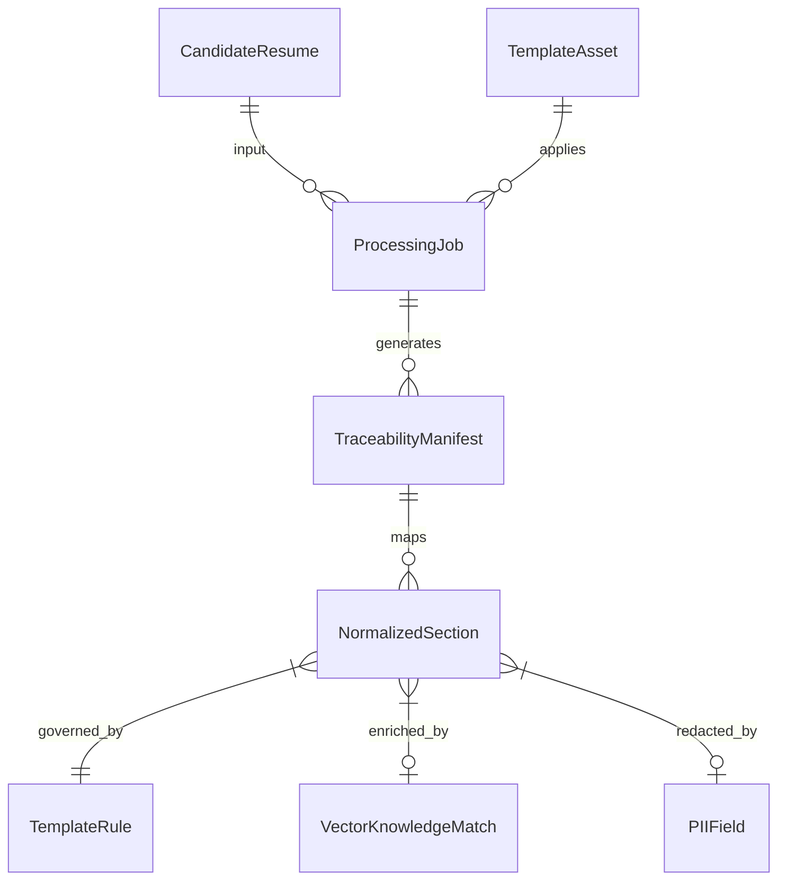
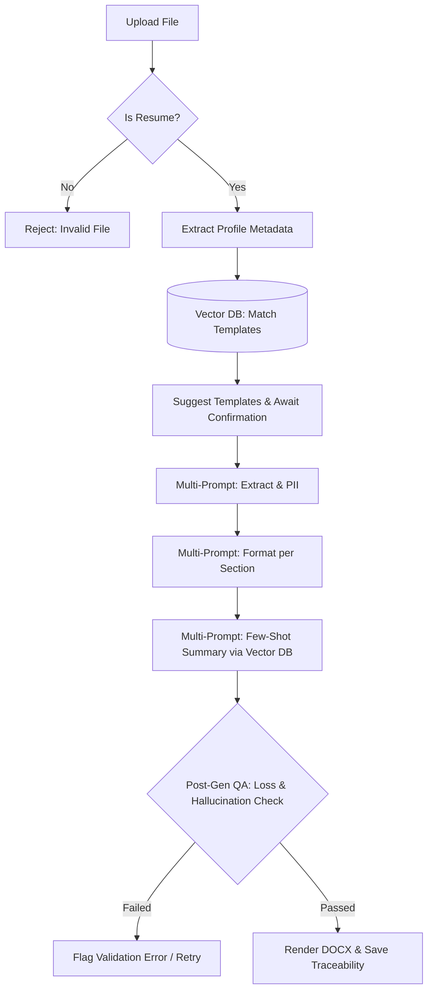

# Resume Processing Architecture & Traceability Analysis

## 1. Traceability Architecture (Database & Vector DB)

To ensure strict traceability from input documents (Resume + Template) to the final output (Rendered DOCX + Summary), the system must map data lineage at every transformation step. Currently, the system relies on the `ProcessingJob` to link `CandidateResume` and `TemplateAsset`. However, we must extend this to explicitly trace PII redactions, knowledge injection, and formatting decisions.

### Current Gaps & Proposed Enhancements
*   **Gap:** A single generated document lacks provenance for *why* a specific field was formatted a certain way or *why* a piece of PII was redacted.
*   **Proposed Solution:** Store a **Traceability Manifest** (as a JSON artifact or relational mapping) linked to the `ProcessingJob`.
    *   **Field-Level Lineage:** Every normalized section/field must reference the source snippet from the raw `CandidateResume`, the `TemplateRule` that governed its format, and the `KnowledgeAsset` (if any) retrieved from the Vector DB that guided the generation.
    *   **Audit Logging:** Every PII redaction must emit a specific `AuditEvent` detailing the matched policy and the confidence score.

### Enhanced Traceability Model (Mermaid)

## 2. Generation Strategy: Single-Prompt vs. Multi-Prompt

Currently, the system attempts a "one-shot" generation where extraction, PII redaction, and template formatting happen in a single LLM prompt.

### Trade-off Analysis

| Feature | Single-Prompt (Current) | Multi-Prompt Pipeline (Proposed) |
| :--- | :--- | :--- |
| **Context Window** | High (~20k - 50k tokens). Passes full resume, all template rules, and formatting guidelines at once. | Low/Medium per prompt. E.g., Extraction: ~10k, Formatting Section 1: ~2k. |
| **Token Cost** | Highly variable, prone to token limits, resulting in truncated outputs. | Slightly higher overall token usage due to prompt repetition, but highly cacheable and predictable. |
| **Quality & Hallucination** | Prone to missing fields and instruction drift (LLM forgets rules by the end). | High precision. Focuses the LLM on exactly one task (e.g., "Format the Experience section using Rule X"). |
| **Traceability** | Poor. Hard to determine which rule caused a specific output change. | Excellent. Each step produces an intermediate artifact that is validated and logged. |

### Proposed Multi-Prompt Pipeline
1.  **Phase 1: Structural Extraction & Redaction**
    *   **Input:** Raw parsed text.
    *   **Task:** Extract raw data into a structured schema (`CandidateResume.normalized_resume_json`) and identify/redact PII based on `PII_guidance`.
2.  **Phase 2: Template-Driven Section Formatting (Iterative/Parallel)**
    *   **Input:** Extracted specific section (e.g., "Experience") + Target `TemplateAsset` formatting rules for that section.
    *   **Task:** Format only that section. This drastically reduces the context window and allows parallel execution.
3.  **Phase 3: Final Synthesis & Summary**
    *   **Input:** Formatted sections + Vector DB contextual knowledge.
    *   **Task:** Synthesize the final document structure and generate the professional summary.

## 3. Vector DB Utilization Enhancements

The Vector DB (Qdrant/Chroma) is currently underutilized, limited to static `KnowledgeAsset` lookups. We will expand its role across the processing lifecycle.

### Smart Template Suggestion
*   **Mechanism:** When a resume is uploaded, extract its core semantic profile (e.g., "Senior Python Developer in FinTech"). Generate an embedding of this profile.
*   **Query:** Perform a cosine similarity search against embeddings of `TemplateAsset.purpose` and `TemplateAsset.expected_sections`.
*   **Outcome:** Returns the top 3 most relevant templates tailored to the candidate's industry and experience level.

### Enhanced Resume Summary Generation
*   **Mechanism:** Summaries should not be generated in a vacuum. The Vector DB stores `KnowledgeAssets` containing "Ideal Summary Examples" by industry (`KnowledgePack`).
*   **Retrieval:** During the summary generation node (`render_node`), the LLM queries the Vector DB with the candidate's profile to retrieve 2-3 "gold standard" summary examples.
*   **Application:** These examples are injected as Few-Shot prompts into the LLM context, guaranteeing high-quality, industry-standard phrasing.

### Contextual Formatting Guidance
*   **Mechanism:** Instead of passing *all* formatting rules to the LLM, embed specific edge-case rules in the Vector DB.
*   **Retrieval:** If a candidate has a unique section (e.g., "Patents" or "Military Service"), the agent queries the Vector DB for formatting guidelines specifically for those sections, minimizing the context window.

## 4. Enhanced Lifecycle Flow: Upload & Post-Generation

To ensure robust data pipelines, the resume processing workflow must handle early failures (invalid files) and late-stage quality control.

### Initial Upload & Triage Flow
1.  **File Type & Content Validation:**
    *   *Action:* Run a fast, lightweight check (using a tiny LLM classifier or regex heuristics over the first page) to determine if the document is actually a resume (e.g., rejecting grocery lists or generic policies).
    *   *Failure:* Return an immediate 400 Bad Request with "Invalid Document Type".
2.  **Semantic Triaging:**
    *   *Action:* Extract high-level metadata (Industry, Seniority).
    *   *Vector DB Hook:* Execute the Smart Template Suggestion query.
3.  **Job Creation:**
    *   *Action:* Store suggested templates and extracted metadata in `CandidateResume.industry_hint` and `CandidateResume.template_hint`. Set status to `WAITING_FOR_CONFIRMATION`.

### Post-Generation Quality Assurance (QA) Flow
Once the multi-prompt generation completes, the system enters a strict QA phase before rendering the DOCX.

1.  **Data Condensation Measurement (Loss Analysis):**
    *   *Action:* Compare the structural footprint (token count, key entity count) of the raw extracted `CandidateResume` against the newly formatted outputs.
    *   *Metric:* If the formatted output lost >15% of critical entities (e.g., missing a job duration), flag a `ValidationResult` failure.
2.  **Confidence & Hallucination Check:**
    *   *Action:* A dedicated verification LLM pass checks if any text in the generated summary or formatted sections *does not exist* in the source document (hallucination detection).
3.  **Traceability Persistence:**
    *   *Action:* Save all validation metrics, missing data reports, and extraction confidence scores into the `ProcessingJob` database record.

### Workflow Visualization (Mermaid)

